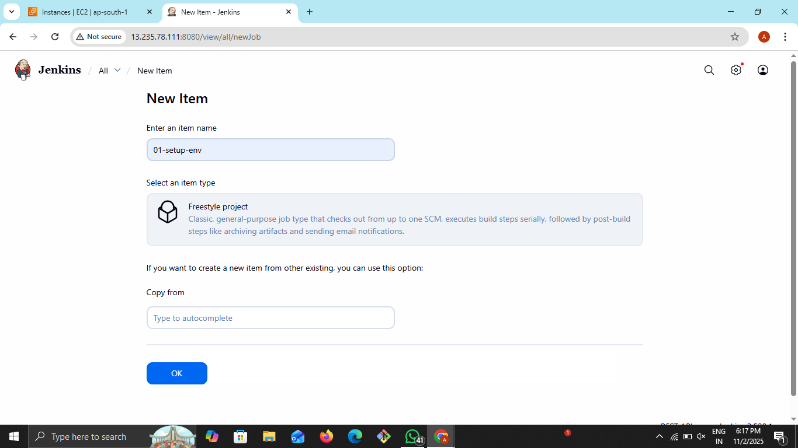
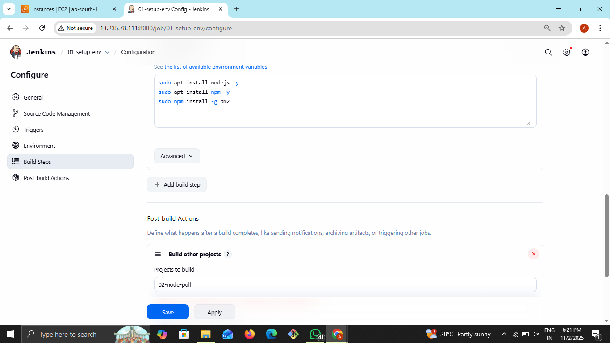
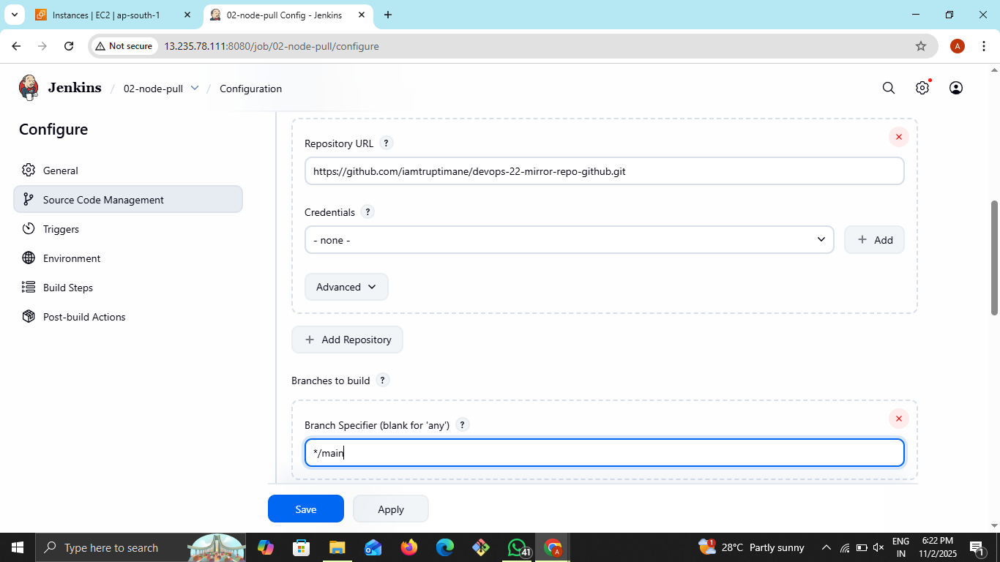
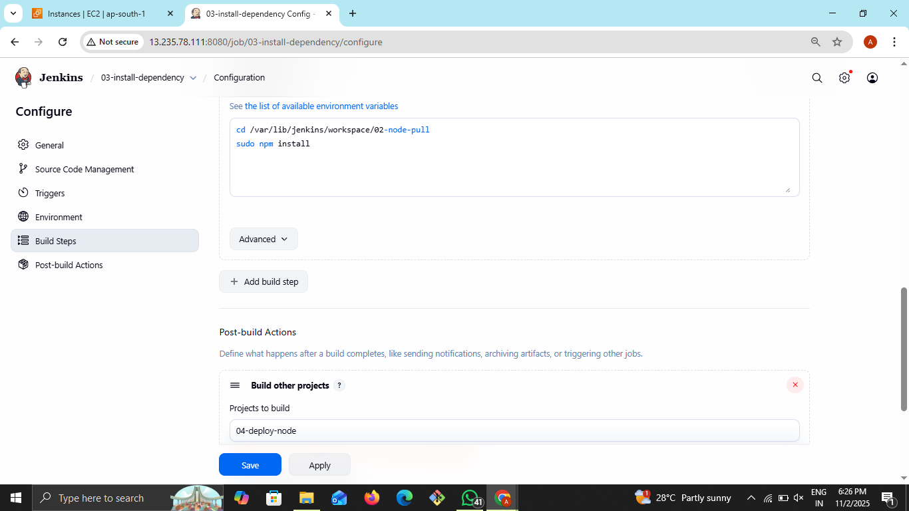
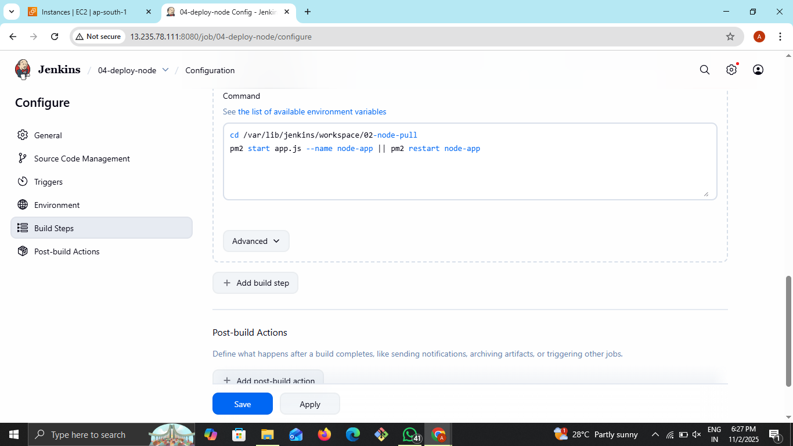

# 🚀 Node.js App Deployment with Jenkins (Freestyle Project)
Automating your Node.js application deployment with Jenkins helps you deliver updates quickly, reliably, and consistently. This tutorial will walk you through setting up Jenkins freestyle projects to pull your code from GitHub, install dependencies, and deploy your Node.js app using pm2.

---

### Architecture Diagram


* Jenkins running the pipeline jobs. The GitHub repo hosts your Node.js application code.
* pm2 ensures your app runs continuously and restarts on failure.
* The application is accessible externally on port 3000.

---

### ✅ Prerequisites
<table border="1" cellpadding="6">
  <thead>
    <tr>
      <th>Requirement</th>
      <th>Description</th>
    </tr>
  </thead>
  <tbody>
    <tr>
      <td>OS</td>
      <td>Ubuntu / Debian Server</td>
    </tr>
    <tr>
      <td>Jenkins</td>
      <td>Installed & Running</td>
    </tr>
    <tr>
      <td>Sudo Access</td>
      <td>Jenkins user can run node/npm installs</td>
    </tr>
    <tr>
      <td>Git Plugin</td>
      <td>Installed in Jenkins</td>
    </tr>
    <tr>
      <td>Repo</td>
      <td>Node.js app hosted on GitHub</td>
    </tr>
    <tr>
      <td>Ports</td>
      <td>Jenkins → 8080 ✅ / App → 3000 ✅</td>
    </tr>
  </tbody>
</table>

---
### 🛠️ Jenkins Freestyle Jobs to Create

We will create four Jenkins freestyle jobs to automate the deployment pipeline:
* **Job-1:** `setup-env:` install node, npm and pm2(globally)
* **job-2:** `node-pull-repo:` Pull latest source code from Git.
* **job-3:**` node-install-deps: `Install Node.js dependencies (npm install).
* **job-4:** `node-deploy-app: `Deploy/start the Node.js application using PM2.

---

### ✅ Job-1: setup-env
* Click New Item.
* Enter name: `setup-env.`
* Choose Freestyle project, click OK.



* Bulid Steps > Execute shell:
```
sudo apt install nodejs -y
sudo apt install npm -y
sudo npm install -g pm2
```


* Add Post-bulid Action > Bulid other project
     * Enter downstream job's name: node-pull-repo

     * Then click save

---
### ✅ Job-2: node-pull-repo

* Click New Item.
* Enter name: node-pull-repo.
* Choose Freestyle project, click OK.
* Scroll to Source Code Management, select Git.
* Enter your Git repository URL, e.g.: < GitHub Repo Url >
* Branch: `main`(or whatever your default is)



* Add Post-bulid Action > Bulid other project  
    * Enter downstream job's name: `node-install-deps`
    * Then click save

---

### ✅ Job-3: node-install-deps
* Click New Item.
* Enter name: node-install-deps.
* Choose Freestyle project, click OK.
* Bulid Steps > Execute shell:
```
cd /var/lib/jenkins/workspace/node-pull-repo
sudo npm install
```


* Add Post-bulid Action > Bulid other project
    * Enter downstream job's name: node-deploy-app
    * Then click save

---

### ✅ Job-4: node-deploy-app

* Click New Item.
* Enter name: node-deploy-app.
* Choose Freestyle project, click OK.
* Bulid Steps > Execute shell:
```
cd /var/lib/jenkins/workspace/node-pull-repo
pm2 start app.js --name node-app || pm2 restart node-app
```


---

### ▶️ Run the Full Pipeline

1. Go to Jenkins dashboard.
2. Click on setup-env.
3. Click Build Now.
4. This will trigger the downstream jobs in order:
    * **setup-env** (install node, npm and pm2)
    * then **node-pull-repo** (pull code),
    * then **node-install-deps** (install dependencies),
    * then **node-deploy-app** (deploy app).

.png)

---

### 🌐 Access Node.js App
open browser and go to
```
http://<Public-IP>:3000
```
.png)

---

### 🛑 Troubleshooting
<table border="1" cellpadding="6">
  <thead>
    <tr>
      <th>Issue</th>
      <th>Fix</th>
    </tr>
  </thead>
  <tbody>
    <tr>
      <td>Permission denied when installing Node/npm</td>
      <td>Add Jenkins user to sudoers</td>
    </tr>
    <tr>
      <td>App not running after deploy</td>
      <td>Check <code>pm2 logs</code></td>
    </tr>
    <tr>
      <td>Port not accessible</td>
      <td>Allow <strong>3000</strong> in firewall / security group</td>
    </tr>
    <tr>
      <td>Git not pulling</td>
      <td>Add credentials in Jenkins Git section</td>
    </tr>
  </tbody>
</table>

---

### ✅ Conclusion

By implementing CI/CD automation using Jenkins Freestyle projects, we successfully built a reliable deployment pipeline for a Node.js application.
This setup ensures:

✔ Automatic code pulling from GitHub  
✔ Dependency installation without manual intervention  
✔ Continuous application uptime managed by PM2  
✔ Faster delivery of updates with reduced errors  
✔ Production-ready workflow for small to mid-scale applications


